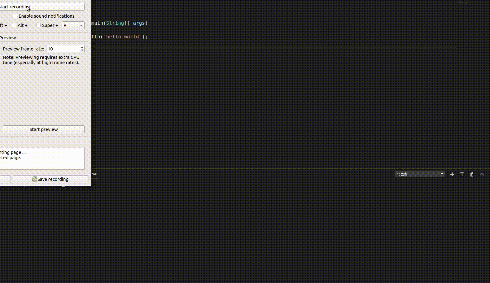

# AutoJava

Tool for realtime java compiling for linux users just like nodemon.



## REQUIREMENTS

* inotify-tools
* bash
* javac compiler

## OS SUPPORTED

Linux all variants

## USAGE

* For using this tool firstly we have to install inotify-tools using:

```bash
sudo apt-get install inotify-tools
```

* For other variants see [wiki](https://github.com/rvoicilas/inotify-tools/wiki)

* After installing you can start live compiler using below command:

```bash
bash autojava.bash filename.java
```

## LICENSE
